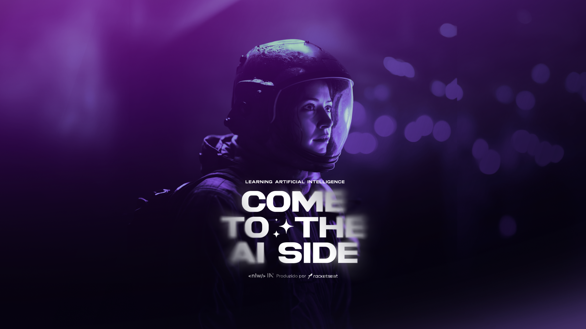

<h1 align="center">
  Next Level Week IA - 2023
</h1>

  <a href="#-tecnologias">Tecnologias</a>&nbsp;&nbsp;&nbsp;|&nbsp;&nbsp;&nbsp;
  <a href="#-projeto">Projeto</a>&nbsp;&nbsp;&nbsp;|&nbsp;&nbsp;&nbsp;
  <a href="#-layout">Layout</a>&nbsp;&nbsp;&nbsp;|&nbsp;&nbsp;&nbsp;
  <a href="#-como-executar">Como executar</a>&nbsp;&nbsp;&nbsp;|&nbsp;&nbsp;&nbsp;
  <a href="#-licença">Licença</a>

## ✨ Tecnologias

Esse projeto foi desenvolvido utilizando as seguintes tecnologias:

- [Next.js](https://nextjs.org/)
- [React](https://reactjs.org)
- [Tailwind](https://tailwindcss.com/)
- [TypeScript](https://www.typescriptlang.org/)
- [Vercel](https://vercel.com/)
- [zod](https://zod.dev/)
- [ai](https://sdk.vercel.ai/)
- [nft.storage](https://nft.storage/)

## 💻 Projeto

Crie títulos envolventes e descrições otimizadas para seus vídeos com facilidade usando nossa aplicação de upload de vídeos, alimentada por inteligência artificial para uma indexação eficaz.

## 🚀 Como executar

1. Clone o repositório

2. Como visualizar a versão para web

   - Instale as dependências com `bun install`
   - Inicie o next.js com `bun dev`
     - Agora você pode acessar [`localhost:3000`](http://localhost:3000) do seu navegador.

## 📄 Licença

Esse projeto está sob a licença MIT. Veja o arquivo [LICENSE](LICENSE.md) para mais detalhes.

---

Feito com ♥️ by OsFlash 🚀

